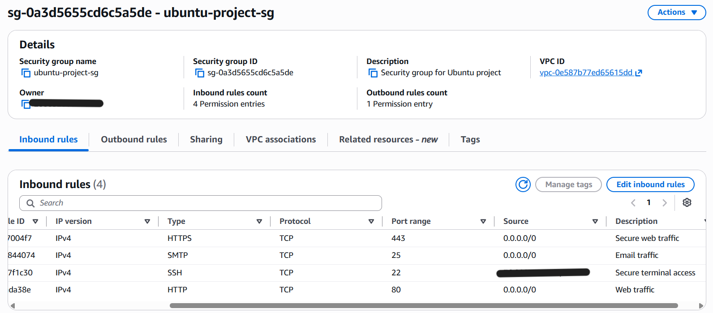
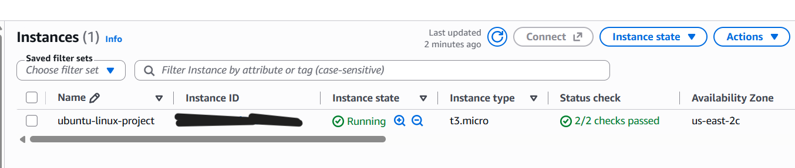
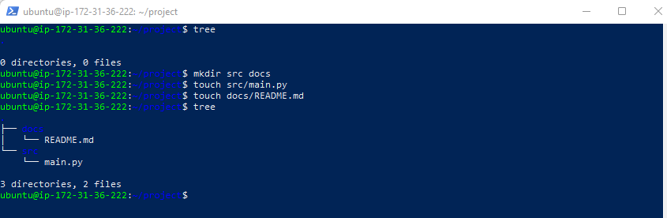
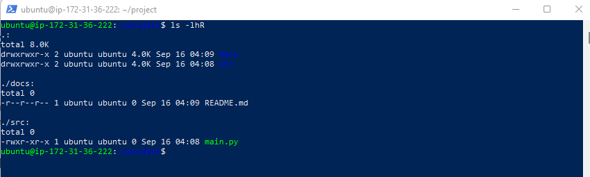
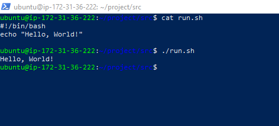
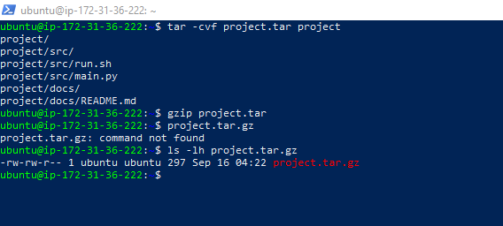
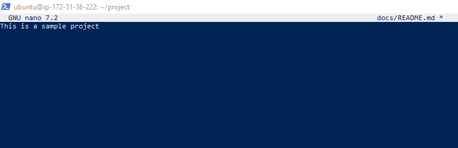

# AWS EC2 and Linux Fundamentals Project

## Overview

This project demonstrates the deployment and administration of an Ubuntu Linux EC2 instance in AWS. I configured network-security rules, connected securely through SSH, practiced Linux file management and permissions, created and executed a Bash script, compressed the project files, transferred the completed work to Windows using SCP, and safely removed the AWS resources afterward.

## Technologies Used

* Amazon EC2
* Amazon EBS
* AWS Security Groups
* Ubuntu Server 24.04 LTS
* Linux command line
* Bash scripting
* SSH and SCP
* Nano text editor
* `tar` and `gzip`
* Windows PowerShell
* GitHub

## Security-Group Configuration

I created a custom security group with the following inbound rules:

| Service | Port | Purpose                                            |
| ------- | ---: | -------------------------------------------------- |
| SSH     |   22 | Secure terminal access restricted to my IP address |
| HTTP    |   80 | Standard web traffic                               |
| HTTPS   |  443 | Encrypted web traffic                              |
| SMTP    |   25 | Email traffic required by the lab                  |

The HTTP, HTTPS, and SMTP rules were configured for this temporary lab environment. SSH access was restricted to a single public IP address using a `/32` CIDR range.



## EC2 Deployment

I launched an Ubuntu Server 24.04 LTS EC2 instance using a `t3.micro` instance type, attached the custom security group, enabled a public IPv4 address, and verified that the instance passed both AWS status checks.



## Linux Directory Structure

I created a project directory with separate folders for source code and documentation:

```text
01-AWS-EC2-Linux-Project/
├── README.md
├── docs/
│   └── README.md
├── src/
│   ├── main.py
│   └── run.sh
└── Screenshots/
```



## File Permissions

I used `chmod` to:

* Make `src/main.py` executable.
* Make `docs/README.md` read-only for all users.
* Make `src/run.sh` executable.

I verified the permissions using `ls -lhR`.



## Bash Script

I created an executable Bash script named `run.sh`:

```bash
#!/bin/bash
echo "Hello, World!"
```

I displayed the script using `cat run.sh` and executed it using:

```bash
./run.sh
```



## Archiving and Compression

I archived the project directory using `tar` and compressed it using `gzip`:

```bash
tar -cvf project.tar project
gzip project.tar
ls -lh project.tar.gz
```



## Nano Text Editing

I used Nano to edit the documentation file and then restored its read-only permissions.



## Secure File Transfer and Resource Cleanup

After completing the Linux tasks, I:

1. Used SCP to securely download the project from the EC2 instance to Windows.
2. Verified the downloaded directory structure and file contents.
3. Terminated the EC2 instance.
4. Confirmed that the associated EBS volume was automatically deleted.
5. Excluded the private `.pem` key, AWS account number, public IP address, and other sensitive information from this repository.

## Skills Demonstrated

* Launching and configuring AWS EC2 instances
* Configuring inbound and outbound security-group rules
* Connecting to Linux through SSH
* Transferring files securely with SCP
* Navigating and managing the Linux filesystem
* Managing Linux file permissions
* Writing and executing Bash scripts
* Editing files with Nano
* Creating compressed archives
* Practicing cloud-resource cleanup and basic cost management
* Documenting technical work in GitHub
